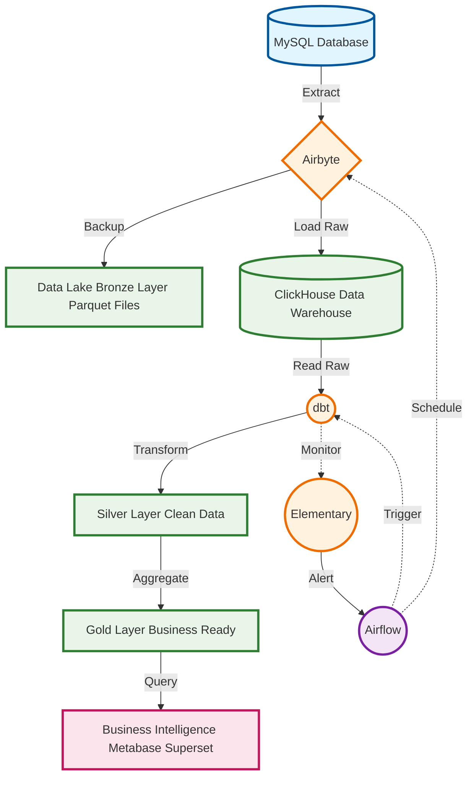

# Arquitectura del Pipeline de Datos:

Patrón de diseño por capas.

## 1. Arquitectura ELT

Se utiliza el siguiente stack disponible para implementar el pipeline **ELT (Extract, Load, Transform)**. En este modelo, los datos se extraen de las fuentes y se cargan casi en crudo en el data warehouse, donde se realizan las transformaciones.

**Flujo de Datos:**

**Etapas del Pipeline**

0.  **Análisis Exploratorio de Datos:**
    *   **Propósito:** La fase inicial de análisis sobre una muestra de datos (`rentabilidad_productos.csv`) reveló varios problemas de calidad de datos. Estos hallazgos son la base para definir las reglas de transformación que se implementarán en la etapa (T) con dbt.
    *   **Hallazgos Clave a Resolver:**
        *   **Nombres de Columnas:** Inconsistentes, con espacios, mayúsculas y caracteres especiales. Deben normalizarse (ej. 'Precio Venta' -> `precio_venta`).
        *   **Tipos de Datos Incorrectos:** Columnas numéricas críticas como `precio_venta` y `margen` estaban almacenadas como texto (`object`) debido a caracteres no válidos.
        *   **Formatos de Fecha Inconsistentes:** La columna `fecha_actualizacion` contenía múltiples formatos de fecha, impidiendo su uso correcto en operaciones temporales.
        *   **Duplicados de Clave Primaria:** Múltiples registros para el mismo `sku`, requiriendo una estrategia de desduplicación (ej. conservar el registro con la `fecha_actualizacion` más reciente).
        *   **Valores Nulos:** Presencia de nulos en columnas importantes como `categoria`, que deben ser manejados (ej. imputar con un valor 'desconocida').
        *   **Espacios en Blanco:** Columnas de texto con espacios sobrantes al inicio o al final, afectando la consistencia de los datos categóricos.

1.  **Extracción y Carga (EL) con Airbyte:**
    *   **Herramienta:** **Airbyte**.
    *   **Flujo:** Airbyte se conecta directamente a la base de datos de producción (**MySQL**). Se configura para extraer los datos de las tablas relevantes (ej. `productos`, `ventas`).
    *   **Destino:** Airbyte carga estos datos en dos lugares simultáneamente:
        1.  Al **Data Lake** como archivos Parquet particionados. Esto crea la capa **Bronze**, para respaldo y reprocesamientos históricos.
        2.  A un esquema de datos crudos (`raw_data`) en **ClickHouse**. Esto prepara los datos para la transformación inmediata.

2.  **Almacenamiento con Data Lake y ClickHouse:**
    *   **Data Lake (Capa Bronze):** Repositorio para los datos crudos extraídos por Airbyte.
    *   **Data Warehouse (Capas Silver y Gold):** **ClickHouse** es el motor analítico. Ideal para las transformaciones y consultas de BI. Contendrá los datos limpios (Silver) y agregados (Gold).

3.  **Transformación (T) con dbt:**
    *   **Herramienta:** **dbt (Data Build Tool)**.
    *   **Flujo:** dbt se conecta a ClickHouse. Lee los datos del esquema `raw_data` y ejecuta una serie de modelos SQL para:
        *   **Limpiar y estandarizar:** Aplica la lógica descubierta en el notebook (normalización de nombres, conversión de tipos, limpieza de texto, estandarización de fechas).
        *   **Desduplicar y modelar:** Aplica la lógica de negocio para consolidar registros (ej. quedarse con el SKU más reciente) y crea modelos de datos limpios y conformados (tablas de dimensiones y hechos).
        *   **Agregar:** Crea tablas agregadas finales (ej. `agg_rentabilidad_por_proveedor`) optimizadas para las consultas de BI.

4.  **Calidad y Observabilidad con Elementary:**
    *   **Herramienta:** **Elementary Data**.
    *   **Integración:** Se puede integrar con Airflow, dbt, ClickHouse, Metabase. Definir pruebas de calidad de datos avanzadas sobre los modelos. Elementary Data va a monitorear los resultados de las pruebas (`dbt test`) con el fin de detectar anomalías en los datos (ej. caídas de volumen, aumento de nulos), proporcionando una capa de observabilidad adicional en el proceso.

5.  **Orquestación con Airflow:**
    *   **Herramienta:** **Airflow**.
    *   **Flujo:** Un DAG de Airflow orquesta todo el proceso, gestionando las dependencias:
        1.  Inicia la tarea de sincronización en **Airbyte**.
        2.  Al completarse, ejecuta los modelos de transformación con `dbt run`.
        3.  A continuación, ejecuta las pruebas de calidad de datos con `dbt test`.
        4.  Gestiona reintentos y envía alertas en caso de fallo.

6.  **Visualización y BI con Superset / Metabase:**
    *   **Herramientas:** **Metabase**.
    *   **Flujo:** Se conecta directamente a las tablas de la capa **Gold** en **ClickHouse** para que los usuarios de negocio puedan explorar datos, crear dashboards y generar reportes.

## 2. Estrategia de Almacenamiento

La Arquitectura Medallion se mantiene, pero ahora con herramientas asignadas.

1.  **Zona Bronze (Raw Data - Datos Crudos):**
    *   **Ubicación:** Data Lake (almacenamiento de objetos como S3, GCS).
    *   **Poblado por:** **Airbyte**.
    *   **Formato:** **Parquet**, particionado por fecha de carga (`load_date=YYYY-MM-DD`).
    *   **Propósito:** Copia exacta e inmutable de la fuente. Permite la recuperación ante desastres y el reprocesamiento completo del pipeline sin volver a consultar MySQL.

2.  **Zona Silver (Cleansed & Conformed Data - Datos Limpios):**
    *   **Ubicación:** Esquema `silver` en **ClickHouse**.
    *   **Creado por:** Modelos de **dbt**.
    *   **Propósito:** Contiene los datos después de aplicar la lógica de limpieza que prototipamos en el notebook: tipos de datos corregidos, cadenas estandarizadas, SKUs desduplicados según la fecha más reciente, nulos manejados. Es la fuente de verdad para el análisis.

3.  **Zona Gold (Curated Business-Level Data - Datos Agregados de Negocio):**
    *   **Ubicación:** Esquema `gold` en **ClickHouse**.
    *   **Creado por:** Modelos de agregación de **dbt** que leen de la capa Silver.
    *   **Propósito:** Tablas pre-agregadas y optimizadas para los casos de uso de negocio. Son las tablas que alimentarán directamente los dashboards en **Superset/Metabase**, garantizando un rendimiento óptimo.

## 3. Consideraciones Operativas con el Stack Específico

### Frecuencia de Ejecución

*   **Recomendación:** Batch diario, programado y ejecutado por un **DAG de Airflow**. Se ejecuta en horas de baja carga para minimizar el impacto en MySQL.

### Manejo de Errores y Reintentos

*   **Reintentos Automáticos:** El **DAG de Airflow** se configurará con reintentos y esperas para manejar fallos transitorios en cualquier etapa (Airbyte, dbt).

### Monitoreo y Alertas

*   **Monitoreo de Ejecución:** La UI de **Airflow** proporciona un monitoreo detallado del estado de cada tarea del pipeline (éxito, fallo, duración). Airflow puede configurarse para enviar alertas (ej. a Slack o email) en caso de fallo del DAG.
*   **Monitoreo de Calidad de Datos:** **Elementary** será nuestra herramienta principal aquí. Se integra con `dbt test` y nos alertará proactivamente sobre problemas de calidad (ej. un `sku` que ya no es único, un aumento anómalo de nulos) directamente en Slack, con contexto y linaje de datos.
